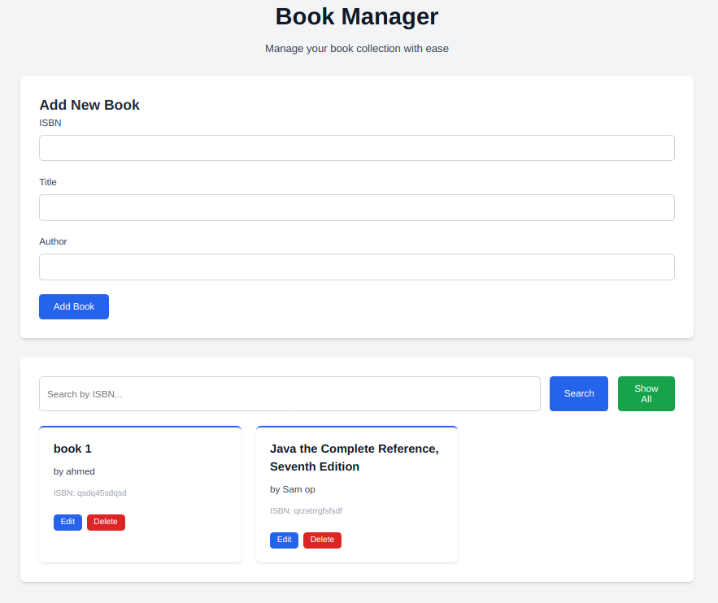
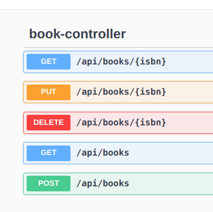

# Book Manager

A web-based microservice application for efficient book management, developed using **Spring Boot**, **PostgreSQL**, and **Redis**.

## Tech Stack

- **Backend:** Java with Spring Boot framework
- **Database:** PostgreSQL for persistent storage
- **Cache:** Redis for optimized performance
- **API Documentation:** Swagger
- **Workflow Management:** Jira (Scrum methodology)
- **Testing Tools:** JUnit and Mockito

## Features

- Full CRUD support for book records
- High-speed data retrieval using Redis cache
- RESTful API endpoints with Swagger UI
- Microservice structure for modular scalability
- Agile development tracked via Scrum in Jira
- Comprehensive unit and integration tests

### Interface

### Swagger
